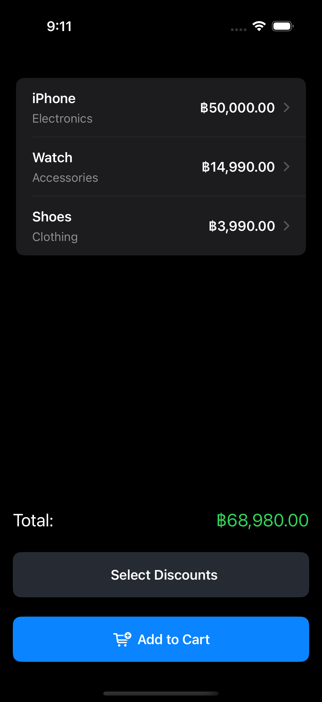
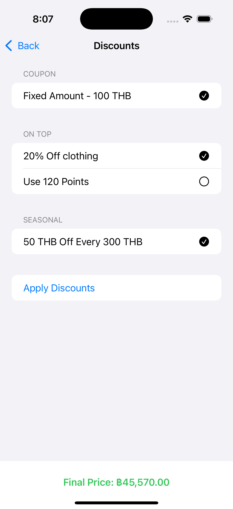
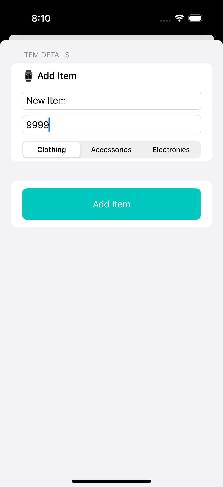

# 🛍️ DiscountModule – Take-Home Assignment

This is a SwiftUI-based application developed as a take-home assignment for **Playtorium**. The app demonstrates a modular discount engine where multiple discount types can be applied to items in a shopping cart.

## 🧑🏻‍💻 Developer

**Panachai Sulsaksakul**

## 🚀 Features

- Add custom items to a shopping cart
- Apply multiple types of discounts:
  - Fixed amount
  - Percentage
  - Category-specific percentage
  - Points-based
  - Seasonal threshold discount
- Discounts are applied in a specific order: Coupon > On Top > Seasonal
- Users can:
  - View total cart value
  - Select discounts per item
  - Delete items
  - Load initial data from local JSON
- Clean, modern UI using SwiftUI with MVVM architecture

## 🏗️ Architecture

- **SwiftUI** for UI
- **MVVM** design pattern
- **Codable** support for `CartItem` and `DiscountCampaign`
- **NavigationLink** for per-item discount editing
- Modular logic via `DiscountCalculator` service

## 🧪 Sample Data (JSON)

Two JSON files are included in the bundle:

- `cart.json`: Sample cart items (not use in project)
- `discounts.json`: All discount types for testing logic

## 📸 Screenshots

## ✅ Requirements Met

- [x] Cart items added dynamically
- [x] Discount campaigns selectable and applied
- [x] Campaign types reflect business rules
- [x] Discounts apply in proper order
- [x] Applied discount summary shown
- [x] Final price calculated correctly
- [x] Code structured for clarity and testability

## 🙏🏻 Thank You

Thank you for reviewing my work. I hope you enjoy testing the DiscountModule app!
